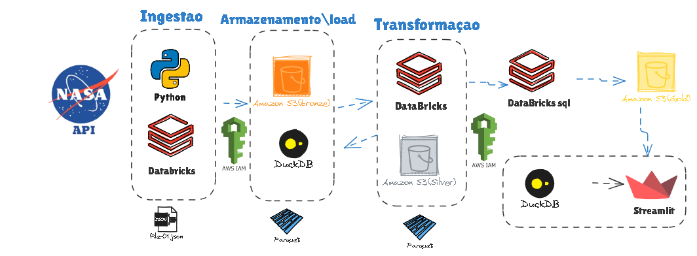

🌌 Projeto: Pipeline de Dados — NASA API com Databricks Lakehouse

O Lakehouse-DataBricks (NASA API) é um projeto completo de engenharia de dados que demonstra, na prática, a construção de um pipeline moderno de dados baseado no conceito de arquitetura Lakehouse.

A partir da API pública da NASA, os dados são coletados, tratados e organizados em múltiplas camadas (Bronze, Silver e Gold), seguindo o modelo Medallion de boas práticas para pipelines.
Todo o fluxo é implementado dentro do Databricks, integrando com AWS S3 para armazenamento, DuckDB como apoio local de consultas e Streamlit para visualização dos resultados.

O principal objetivo deste projeto é mostrar um fluxo real de engenharia de dados de ponta a ponta, utilizando ferramentas amplamente usadas no mercado, em um cenário que simula um projeto de dados corporativo moderno.

🧠 O que este projeto demonstra

Conceitos práticos de ETL/ELT dentro da arquitetura Lakehouse.
Uso combinado de Python, Databricks, AWS e Streamlit em um pipeline real.
Aplicação de boas práticas de versionamento, governança e visualização de dados.
Capacidade de integração entre múltiplas ferramentas cloud e open source.

⚙️ Arquitetura e Fluxo de Dados
O fluxo segue o modelo Medalhão (Bronze → Silver → Gold):

Ingestão
Linguagem: Python
Ferramentas: Databricks Notebooks
Fonte de dados: NASA API
Armazenamento inicial: Amazon S3 (Bronze)
Arquivos salvos em formato JSON e convertidos para Parquet

Armazenamento e Load
Amazon S3 para camadas Bronze/Silver/Gold
DuckDB para testes e consultas locais
Controle de permissões via AWS IAM

Transformação
Databricks SQL e PySpark
Limpeza, tratamento e normalização dos dados (Silver)
Criação de métricas e agregações (Gold)

Visualização
Streamlit conectado à camada Gold
Dashboards interativos mostrando os principais insights dos dados da NASA

  

